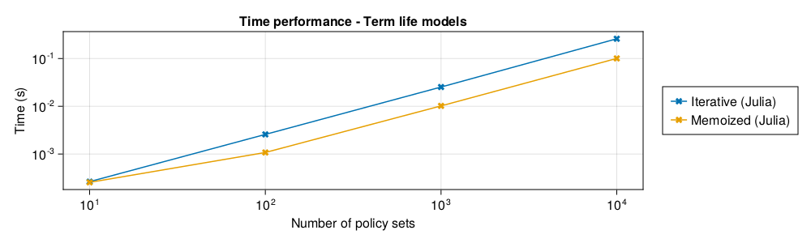
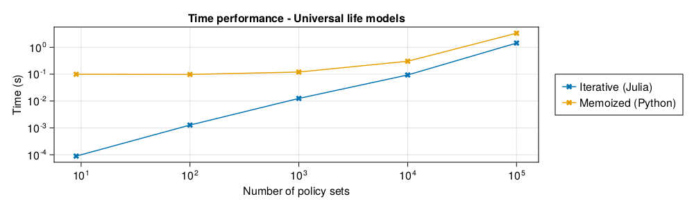
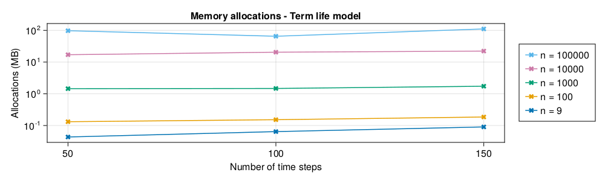
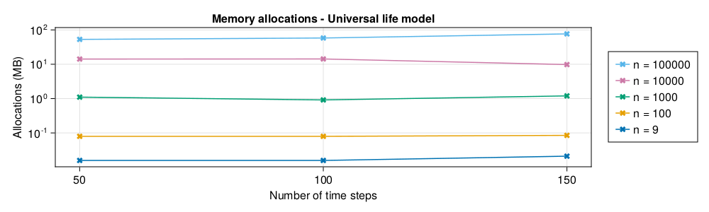

# Benchmarking

Benchmarks in this repository:

* `basic_term_benchmark`: Replicate the cashflows of the [LifeLib BasicTerm model](https://github.com/lifelib-dev/lifelib/tree/main/lifelib/libraries/basiclife/BasicTerm_M)
    * Python [LifeLib BasicTerm_M](https://github.com/lifelib-dev/lifelib/tree/main/lifelib/libraries/basiclife/BasicTerm_M)
    * Julia [using LifeSimulator](https://github.com/JuliaActuary/LifeSimulator.jl)
    * Python [using custom memoization decorator](https://github.com/actuarialopensource/benchmarks/blob/main/Python/basicterm_scratch.py)
    * Python [using JAX](https://github.com/actuarialopensource/benchmarks/blob/main/Python/basicterm_jax.py)
* `exposures`: Create date partitions for experience studies
    * Julia [ExperienceAnalysis](https://github.com/JuliaActuary/ExperienceAnalysis.jl)
    * R [actxps](https://github.com/mattheaphy/actxps)
* `mortality`: Read SOA mortality tables and use them in a simple calculation
    * Julia [MortalityTables](https://github.com/JuliaActuary/MortalityTables.jl)
    * Python [Pymort](https://github.com/actuarialopensource/pymort)

The below results are generated by the benchmarking scripts in the folders for each language. These scripts are run automatically by GitHub Actions and populate the results below. 
```yaml 
basic_term_benchmark:
- Julia Benchmarks basic_term:
    minimum time: TrialEstimate(117.970 ms)
    result: 1.4489630534602132e7
- Python jax basic_term_m:
    minimum time: 134.66079499997363 milliseconds
    result: 14489630.534632105
  Python lifelib basic_term_m:
    minimum time: 647.1656060000015 milliseconds
    result: 14489630.534629744
  Python scratch basic_term_m:
    minimum time: 546.5953730000024 milliseconds
    result: 14489630.53463211
exposures:
- Julia ExperienceAnalysis.jl:
    minimum time: TrialEstimate(39.168 ms)
    num_rows: 141281
- R actxps:
    min: 809.4926 ms
    num_rows: 141281
mortality:
- Julia MortalityTables.jl:
    minimum time: TrialEstimate(289.403 μs)
    result: 1904.4865526636793
- Python PyMort:
    minimum time: 10.543537000003766 milliseconds
    result: 1904.4865526636793
savings_benchmark:
- Julia Benchmarks savings:
    minimum time: TrialEstimate(143.778 ms)
    result: 3.507113709040271e12
- Python lifelib cashvalue_me_ex4:
    minimum time: 643.7249829999985 milliseconds
    result: 3507113709040.1416
```
## Analysis

This section is dedicated to the analysis and comparison of performance characteristics between the iterative and memoization-based implementations. All iterative implementations are new and implemented in [LifeSimulator.jl](https://github.com/JuliaActuary/LifeSimulator.jl). Memoization-based implementations use or were inspired by [lifelib](https://github.com/lifelib-dev/lifelib). For the term life model, a memoization-based algorithm has been reimplemented in Julia; however, for the universal life model, we fall back to lifelib's Python implementation.

First, computation time is compared between iterative and memoization-based implementations. Second, memory complexity is analyzed for the iterative implementation of the term life and universal life models.

The analysis was performed using on this machine and Julia version:

```julia
julia> versioninfo()
Julia Version 1.11.0-DEV.483
Commit ebe1a37af57 (2023-09-16 12:52 UTC)
Build Info:
  Official https://julialang.org/ release
Platform Info:
  OS: Linux (x86_64-linux-gnu)
  CPU: 20 × 12th Gen Intel(R) Core(TM) i7-12700H
  WORD_SIZE: 64
  LLVM: libLLVM-15.0.7 (ORCJIT, alderlake)
  Threads: 29 on 20 virtual cores
```

### Time complexity




#### Performance

Using the Julia implementation of the universal life model, we can easily simulate millions of policies:

```julia-repl
julia> policies = rand(PolicySet, 10_000_000);

julia> model = LifelibSavings();

julia> @time CashFlow(model, policies, 150);
103.615767 seconds (84 allocations: 8.473 GiB, 0.01% gc time)
```

### Memory complexity

We discuss here the memory complexity associated with the iterative implementation of the term life and universal life models. The theoretical memory complexity is $O(P)$, with $P$ the number of policies.

The following images illustrate that the memory complexity may be assumed independent of the number of timesteps, and that it may be assumed to scale linearly in the number of policy sets. Note however that measuring the true memory complexity is tricky in a garbage-collected language; results are approximates at best and certinaly not a rigorous proof of what we advance.

#### Term life model




#### Universal life model




