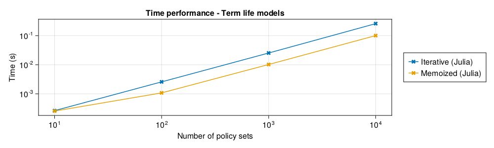
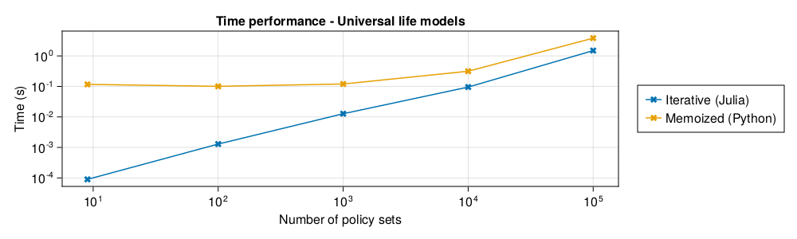
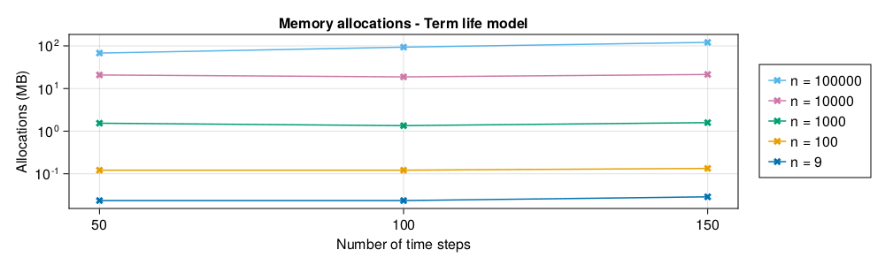
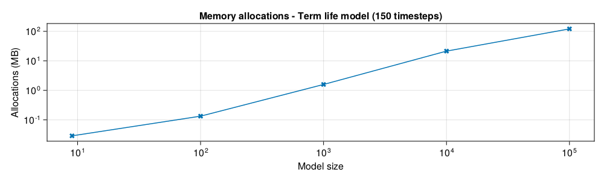
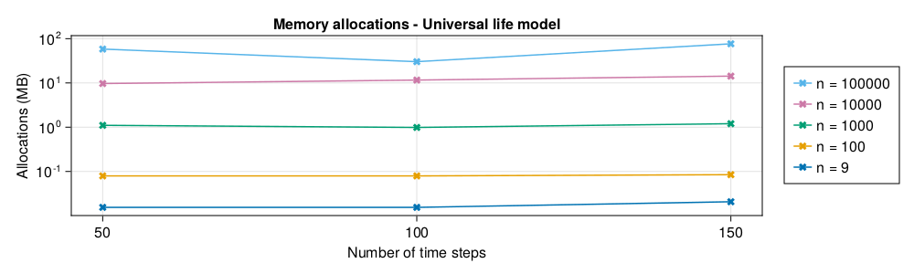
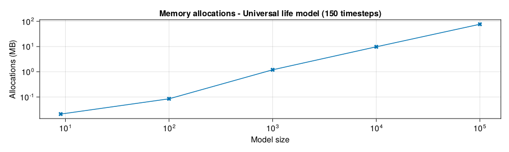

## Analysis

This section is dedicated to the analysis and comparison of performance characteristics between the iterative and memoization-based implementations. All iterative implementations are new and implemented in [LifeSimulator.jl](https://github.com/JuliaActuary/LifeSimulator.jl). Memoization-based implementations use or were inspired by [lifelib](https://github.com/lifelib-dev/lifelib). For the term life model, a memoization-based algorithm has been reimplemented in Julia; however, for the universal life model, we fall back to lifelib's Python implementation.

First, computation time is compared between iterative and memoization-based implementations. Second, memory complexity is analyzed for the iterative implementation of the term life and universal life models.

The analysis was performed using on this machine and Julia version:

```julia
julia> versioninfo()
Julia Version 1.11.0-DEV.483
Commit ebe1a37af57 (2023-09-16 12:52 UTC)
Build Info:
  Official https://julialang.org/ release
Platform Info:
  OS: Linux (x86_64-linux-gnu)
  CPU: 20 × 12th Gen Intel(R) Core(TM) i7-12700H
  WORD_SIZE: 64
  LLVM: libLLVM-15.0.7 (ORCJIT, alderlake)
  Threads: 29 on 20 virtual cores
```

### Time complexity




#### Performance

Using the Julia implementation of the universal life model, we can easily simulate millions of policies:

```julia-repl
julia> policies = rand(PolicySet, 10_000_000);

julia> model = LifelibSavings();

julia> @time CashFlow(Simulation(model, policies), 150);
103.615767 seconds (84 allocations: 8.473 GiB, 0.01% gc time)
```

### Memory complexity

We discuss here the memory complexity associated with the iterative implementation of the term life and universal life models. The theoretical memory complexity is $O(P)$, with $P$ the number of policies.

The following images illustrate that the memory complexity may be assumed independent of the number of timesteps, and that it may be assumed to scale linearly in the number of policy sets. Note however that measuring the true memory complexity is tricky in a garbage-collected language; results are approximates at best and certinaly not a rigorous proof of what we advance.

#### Term life model





#### Universal life model




